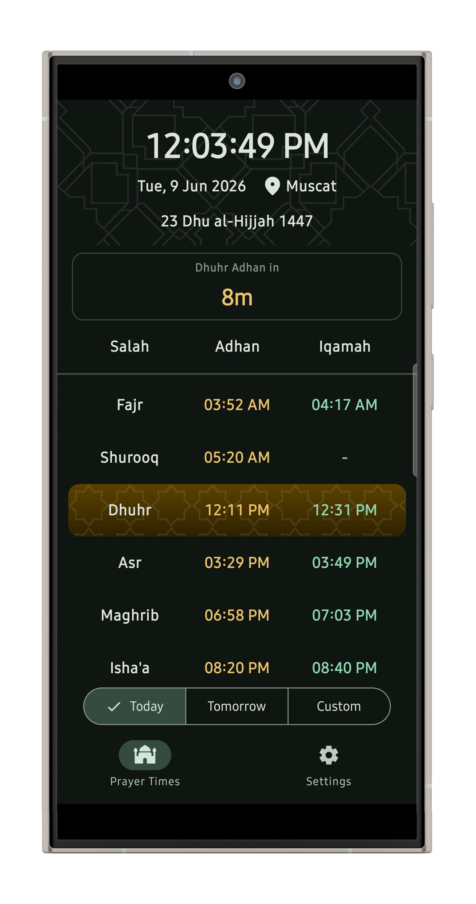
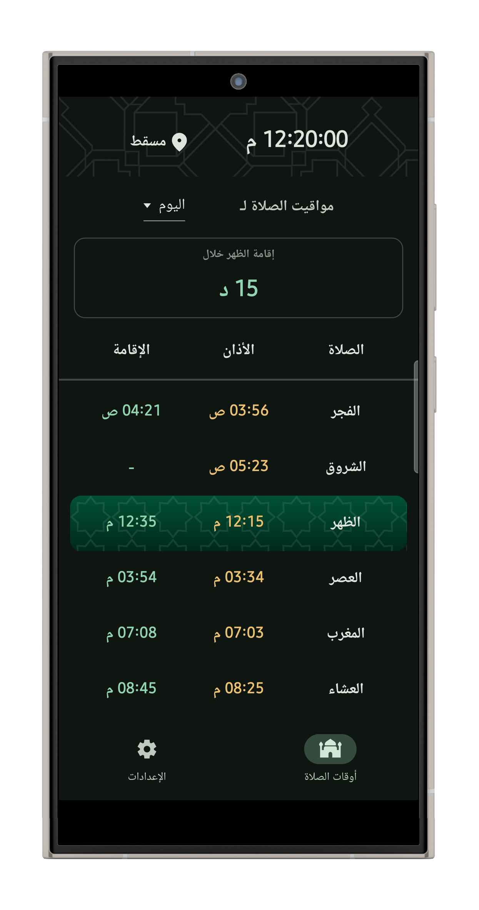
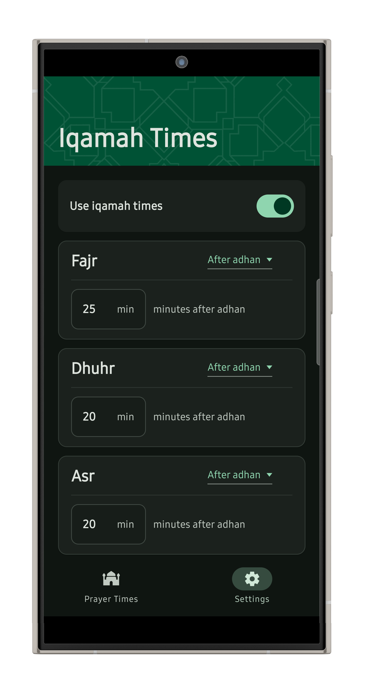
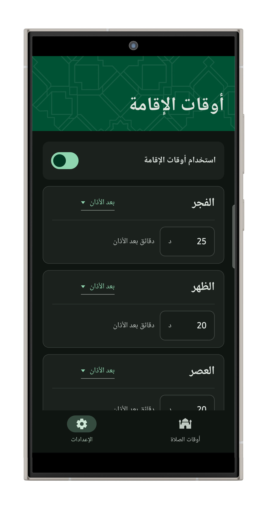

# Oman Prayer Times

<a href='https://play.google.com/store/apps/details?id=com.codealyst.omanprayertimes'></a>

<p align="center">
    
</p>

**An app for viewing daily prayer times in Oman from the
Ministry of Endowments and Religious Affairs (MERA)'s website.**

## Screenshots

<table>
  <tr>
    <td></td>
    <td></td>
  </tr>
  <tr>
    <td></td>
    <td></td>
  </tr>
</table>

## API

**[Ministry of Endowments and Religious Affairs
(MERA)'s website](https://www.mara.gov.om/calendar_page2.asp)**

**[GitHub repository for the API](https://github.com/RealUltra/oman-prayer-times-api)**

## Features

- **Prayer Times Table:** View salah, adhan, and iqamah times from the **Ministry of Endowments and
  Religious Affairs (MERA)**' website.
- **Next Event Timer:** View the remaining time until the next adhan or iqamah.
- **Iqamah Times:** Set the Iqamah Times according to your local mosque.
- **Reminders:** Set custom reminders for the adhan or iqamah.
- **86 Cities:** All cities available on MERA's website.
- **Multiple Languages:** Available in Arabic & English.

## Tech Stack

- **Language:** Kotlin
- **UI:** Jetpack Compose
- **Design System:** Material 3
- **Build System:** Gradle
- **Minimum SDK:** 23
- **Target SDK:** 36

## Getting Started

Clone the project and open it in Android Studio.

To compile from the command line:

```powershell
.\gradlew.bat :app:compileDebugKotlin
```

To build a debug APK:

```powershell
.\gradlew.bat :app:assembleDebug
```

## Planned

### v26.07.1

- Added: Auto-detection of cities.

### v26.06.3

- Improve in-app updates.
- Add In-app reviews.

### v26.06.2

- Add Custom Reminders
- Add Language, City, Iqamah Times and Reminders setup on startup.
- Add Android Widgets

## Changelog

### v26.06.1

- Added: Prayer Times from MERA's website for any date.
- Added: Next Event Timer.
- Added: Prayer Times caching for offline use.
- Added: Settings Page
- Added: Iqamah Times
- Added: Theme Settings
- Added: City Selection
- Added: Language Settings
- Added: Arabic translation
- Added: In-app updates.
- 